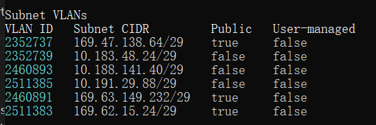
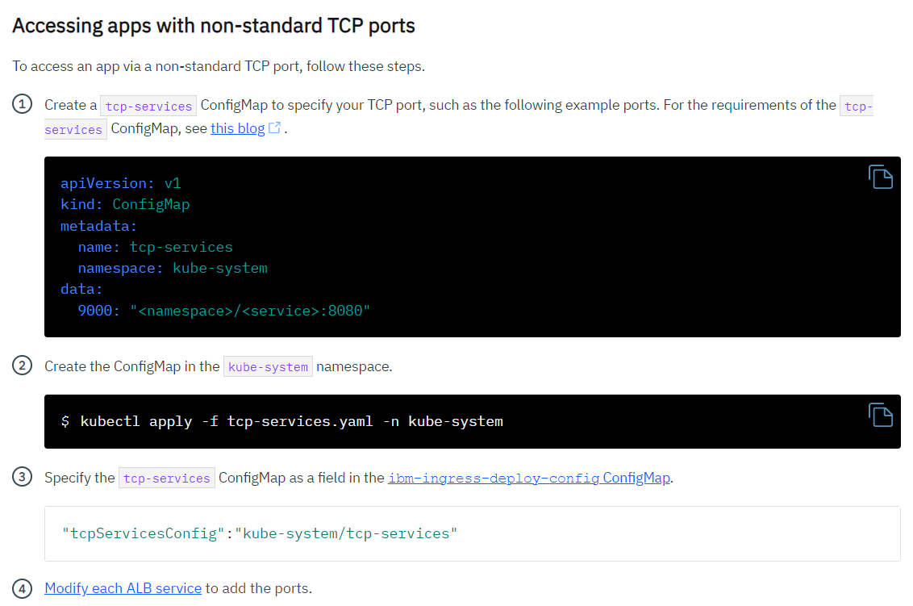
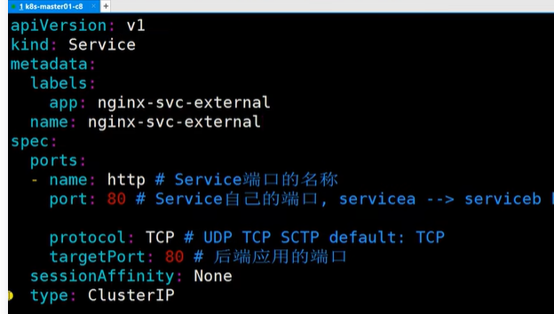
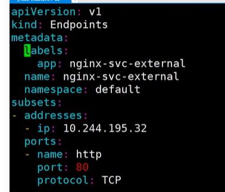
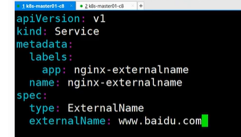
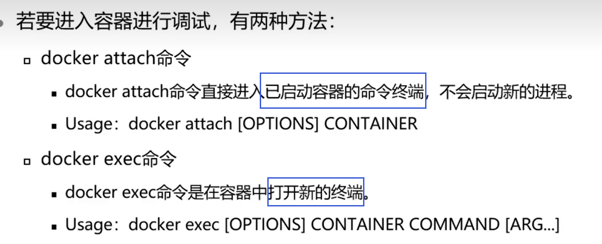

# Study Kubernetes

K8s online
https://kubernetes.io/docs//tutorials/hello-minikube/

## VLAN

Create Cluster => a private and a public vlan were created automaticlly for each zone => 
if it is a multizone cluster => open a support ticket to enable VRF(vitual routing and forwarding), VRF enables all the private VLANs and subnets in your infrastructure account to communicate with each other. 

```
ibmcloud ks cluster get --cluster b75ecd28fd3b408a94c9a0b724a28bc7 --show-resources
```


## ALB

Ingress is a Kubernetes service discovery method that balances network traffic workloads in your cluster by forwarding public or private requests to your apps. You can use Ingress to expose multiple app services to the public or to a private network by using a unique public or private route.

Ingress consists of three components:

    Ingress resources
    Application load balancers (ALBs)
    A multizone load balancer (MZLB). A load balancer to handle incoming requests across zones. For classic clusters, this component is the multizone load balancer (MZLB) that IBM Cloud Kubernetes Service creates for you. For VPC clusters, this component is the VPC load balancer that is created for you in your VPC.

* Ingress resource
To expose an app by using Ingress, you must create a Kubernetes service for your app and register this service with Ingress by defining an Ingress resource. The Ingress resource is a Kubernetes resource that defines the rules for how to route incoming requests for apps.

* Application load balancer (ALB)
The application load balancer (ALB) is an external load balancer that listens for incoming HTTP, HTTPS, or TCP service requests. The ALB then forwards requests to the appropriate app pod according to the rules defined in the Ingress resource.

* Classic cluster multizone load balancer (MZLB)
Whenever you create a multizone cluster or add a zone to a single zone cluster, an Akamai multizone load balancer (MZLB) is automatically created and deployed so that 1 MZLB exists for each region. The MZLB puts the IP addresses of your ALBs behind the same subdomain and enables health checks on these IP addresses to determine whether they are available or not.

* Expose TCP ports
Ingress application load balancer will be created automatically when your cluster is created.
You can also create new ALB or update the current ALB.
To expose TCP applications, create CM ibm-ingress-deploy-config to specify tcp-ports CM of each ALB.
Then list all your TCP ports in a new CM kube-system/custom-tcp-ports.
Edit each ALB service to open the TCP ports. and do a refresh

Create a YAML file for an ibm-ingress-deploy-config ConfigMap.
```
apiVersion: v1
kind: ConfigMap
metadata:
 name: ibm-ingress-deploy-config
 namespace: kube-system
data:
 private-cr5f6431dcf6a14abd88bb6fada18e226f-alb7: '{"tcpServicesConfig":"kube-system/custom-tcp-ports"}'
 private-cr5f6431dcf6a14abd88bb6fada18e226f-alb8: '{"tcpServicesConfig":"kube-system/custom-tcp-ports"}'
 private-cr5f6431dcf6a14abd88bb6fada18e226f-alb9: '{"tcpServicesConfig":"kube-system/custom-tcp-ports"}'
 public-cr5f6431dcf6a14abd88bb6fada18e226f-alb7: '{"tcpServicesConfig":"kube-system/custom-tcp-ports"}'
 public-cr5f6431dcf6a14abd88bb6fada18e226f-alb8: '{"tcpServicesConfig":"kube-system/custom-tcp-ports"}'
 public-cr5f6431dcf6a14abd88bb6fada18e226f-alb9: '{"tcpServicesConfig":"kube-system/custom-tcp-ports"}'
```

Create a YAML file for an custom-tcp-ports ConfigMap.
```
apiVersion: v1
kind: ConfigMap
metadata:zZ
  name: custom-tcp-ports
  namespace: kube-system
data:
  "3000": qa-datapower/qa-mqdatapower:3000
  "10002": qa-datapower/qa-mqdatapower:10002
  "10003": qa-sftpdsgpub/qa-octopus:10003
  "10004": qa-datapower/qa-sftpdatapower:10004
  "40002": prod-datapower/prod-sftpdatapower:40002
  "40003": prod-datapower/prod-datapower:40003
``` 

Edit ALB service to add ports part to open TCP ports, don't add nodePort!
```
apiVersion: v1
kind: Service
metadata:
  annotations:
    razee.io/build-url: https://travis.ibm.com/alchemy-containers/armada-ingress-microservice/builds/43020212
    razee.io/source-url: https://github.ibm.com/alchemy-containers/armada-ingress-microservice/commit/33ff564362adda87e0db282d97abd907841cf7a0
    service.kubernetes.io/ibm-load-balancer-cloud-provider-ip-type: private
    service.kubernetes.io/ibm-load-balancer-cloud-provider-vlan: "2511385"
    service.kubernetes.io/ibm-load-balancer-cloud-provider-zone: wdc07
  creationTimestamp: "2021-01-07T14:41:51Z"
  finalizers:
  - service.kubernetes.io/load-balancer-cleanup
  labels:
    app: private-crb75ecd28fd3b408a94c9a0b724a28bc7-alb1
  name: private-crb75ecd28fd3b408a94c9a0b724a28bc7-alb1
  namespace: kube-system
  resourceVersion: "180703821"
  uid: 80064ac1-1768-4821-8271-09ad93ba8bf9
spec:
  clusterIP: 172.21.206.194
  clusterIPs:
  - 172.21.206.194
  externalTrafficPolicy: Cluster
  internalTrafficPolicy: Cluster
  loadBalancerIP: 10.191.29.90
  ports:
  - name: port-80
    nodePort: 30835
    port: 80
    protocol: TCP
    targetPort: 80
  - name: port-443
    nodePort: 30129
    port: 443
    protocol: TCP
    targetPort: 443
  - name: port-8001
    nodePort: 30344
    port: 8001
    protocol: TCP
    targetPort: 8001
  - name: port-40018
    nodePort: 30280
    port: 40018
    protocol: TCP
    targetPort: 40018
  selector:
    app: private-crb75ecd28fd3b408a94c9a0b724a28bc7-alb1
  sessionAffinity: None
  type: LoadBalancer
status:
  loadBalancer:
    ingress:
    - ip: 10.191.29.90
```

## 动态更新image版本
```
kubectl set image deployment nginx nginx-1.15.4 --record
```

## 给资源打标签
label给k8s各种资源分类，通过label过滤找到对应的资源

```
kubectl label node k8s-node01 k8s-node02 prod=true

看label kubectl get deployment -n qa-mqpassopen -owide

deployment的yaml里写
  spec:
    nodeSelector:
      prod:true
```

删除标签，修改标签

```
kubectl label node k8s-node01 k8s-node02 prod-

kubectl label node k8s-node01 k8s-node02 prod=false --overwrite
```

select长语法
```
kubectl get po -A -l 'prod in (true, false)'

kubectl get po -A -l prod!=false
```

## 回滚

回滚到上一版本
```
kubectl rollout undo deployment nginx
```
看历史版本
```
kubectl rollout history deployment nginx
```
看指定版本详细信息
```
kubectl rollout history deployment nginx --revision=revision number 
```
回滚到指定版本
```
kubectl rollout undo deployment nginx --to-revision=revision number 
```

## 扩容

```
kubectl scale --replicas=3 deployment nginx
```
自动扩容 HPA（Horizontal Pod Autoscaling） 观察pod的cpu和内存使用率来自动扩展或者缩容pod的数量，还可以通过自定义的流量API自动扩缩容。
需要先装好metrics-server，用top命令看cpu及内存使用量。
```
kubectl top pod -n qa-sftpdsgpub
```
deployment yaml中必须定义request参数，cpu使用率达到request的%多少之后，进行扩缩容。

```
kubectl autoscale deployment qa-sftpdsgpub -n qa-sftpdsgpub --cpu-percent=100 --min=2 --max=5

kubectl get hpa -n qa-sftpdsgpub
```


## 探针

1. startupProbe 判断是否启动  会杀pod
2. livenessProbe 判断是否运行   会杀pod
3. readynessProbe 判断是否健康  不会杀，但是会拿掉endpoint

### 检测方式 

1. ExecAction 容器内执行一个命令，返回值为0，认为容器健康。
2. TCPSocketAction 通过TCP连接检查是否端口是否开启，类似telnet
3. HTTPGetAction 用程序API来检查，用的最多


## service反代外部服务

service建立的时候selector不指向pod，手动建立一个endpoint，endpoint的地址改为外部服务地址。
endpoint的名称必须和service一致，这样就能自动找到service对应的endpoint。
集群内用service的地址去访问qa-mqoctopus.qa-sftpdsgpub.svc.cluster.local。




Service反代外部域名，用的比较少，会有跨域问题。


## 创建临时pod用busybox

```
kubectl run -it --image busybox busybox --rm /bin/sh
```

## docker attach exec
